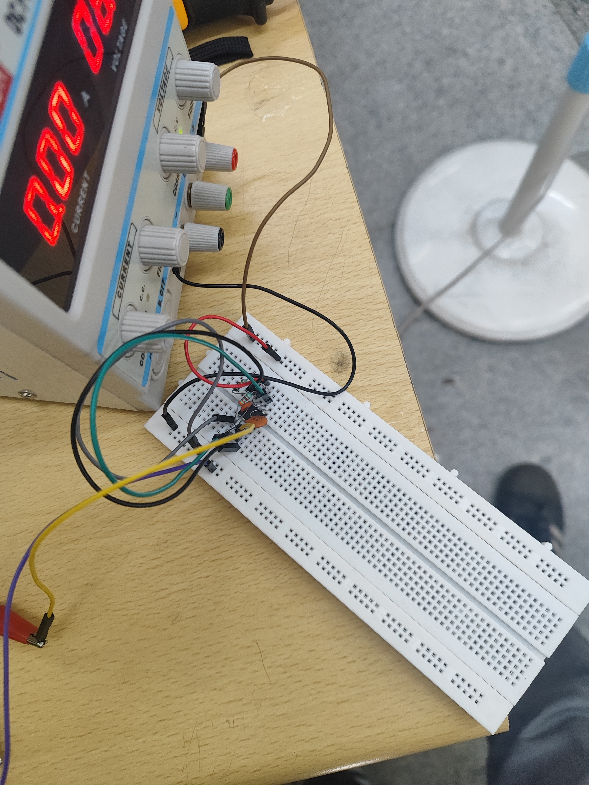

# MARVEL COURSEWORK

## 1. 3D Printing

******
#

I explored 3d printing for the first time in MARVEL UVCE. 
- I understood how the printer works.
- I understood what are the requirements for basic 3d printing.
- I understood how to use slicing software ultimater cura and printer settings.

It was a great hands on experience.

## 2. API
***********
#

.png)

**API** stands for **Application Programming Interface**. It's essentially a set of rules and protocols that allows different software applications to communicate with each other. APIs define the methods and data formats that applications can use to request and exchange information.

I used covid API to keep in track of the covid cases that occured worldwide.

Click [here](https://sudharshanhegde.github.io/covid/)  to visit my webpage.

## 3. Working with GitHub
*******
#

.png)

**GitHub** is a popular and free code hosting platform, serving as the go-to platform for developers whether they are contributing to open-source projects or showcasing personal work.

**Git** is a version control software used to manage different versions of the same project, enabling the creation of branches so that we can revert back to the previous version of the code if something goes wrong. Git proves particularly useful during team projects, where multiple individuals can collaborate on the same project.

I learnt how to do open source contribution including forking and correcting the code  submitting pull and merge requests from Marvel git-test repository

## 4. Kaggle Contest
*************
#

.png)

**Kaggle** is a popular data science learning and contest platform where users can learn and test their knowledge of machine learning and data science by competing with others, with the chance to win substantial cash prizes.

I trained my first machine learning model using pandas for the **Titanic ML** contest on Kaggle, predicting the survival rate of passengers based on gender and age.This was my first hands on experience in the field of machine learning.

## 5. Working with Pandas and Matplotlib
************
#

<iframe width="560" height="315" src="https://www.youtube.com/embed/g9k62vhZUcE?si=jHbe4EC2o4gB98Ae" title="YouTube video player" frameborder="0" allow="accelerometer; autoplay; clipboard-write; encrypted-media; gyroscope; picture-in-picture; web-share" referrerpolicy="strict-origin-when-cross-origin" allowfullscreen></iframe>

**Pandas**: A Python library used for data manipulation and analysis. It provides data structures like Series (1-dimensional) and DataFrame (2-dimensional) for handling data efficiently.

**Matplotlib**: A plotting library for creating static, interactive, and animated visualizations in Python. It works well with Pandas for plotting data.

**Scatter Plot**: A graph that uses dots to represent values for two different numeric variables. Each dot on the plot represents an individual data point.

**Line Graph**: A type of chart used to show information that changes over time. Points are connected by lines to show trends.

**Bar Graph**: A chart that presents categorical data with rectangular bars. Each bar's length or height represents the value of the category it represents.

I used pandas and Matplotlib libraries on the data of sales and I plotted the graph.

## 6. Creating Portfolio Webpage
*****
#

.png)

**HTML**: The standard language for creating webpages. It structures content on the web using elements like headings, paragraphs, links, images, and more.

**CSS**: A style sheet language used to describe the presentation of a document written in HTML. It controls the layout, colors, fonts, and overall visual appearance of webpages.

**JavaScript**: A programming language that enables interactive and dynamic content on webpages. It can manipulate HTML and CSS, handle events, validate forms, create animations, and more.

Click [here](https://sudharshanhegde.github.io/portfoliowebsite/) to visit my webpage.

## 7. Writing Research Article using Markdown
*****
#

.png)

I wrote regarding the chatgpt and its powers namely "Unleashing the power of Chatgpt : Your ultimate ai assistant".

Click [here](ResearchArticle.md) to read the article.

## 8. Speed Control of DC Motor
*****
#

<iframe width="560" height="315" src="https://www.youtube.com/embed/wlLhVRsp-6s?si=jGL1Renl9pv2INY-" title="YouTube video player" frameborder="0" allow="accelerometer; autoplay; clipboard-write; encrypted-media; gyroscope; picture-in-picture; web-share" referrerpolicy="strict-origin-when-cross-origin" allowfullscreen></iframe>

Control the speed of a 5V BO motor by utilizing an Arduino board and the L298N motor driver. This task involves employing an UNO board and an H-Bridge L298N motor driver to regulate the speed of the DC motor. It's a practical application, showcasing how to interface these components to achieve motor control through an Arduino-based setup. Simulated on Tinkercad first and tried to implement the same practically.

## 9. Soldering Prerequisites
*****
#

I learned soldering techniques and safety protocols, essential for hardware projects involving circuit assembly and repairs.

## 10. Astable Multivibrator
*****
#

A 555 astable multivibrator is a type of oscillator circuit that generates a continuous square wave output.
This circuit is a basic oscillator that produces a continuous pulse output. The frequency is adjustable using two resistors, R1 and R2. To achieve a 60% duty cycle, the relationship between R1 and R2 is set as R1 equal to 2 times R2.

## 11. Kmaps and Deriving Logic Circuit
*******
#

Karnaugh map is a method of simplifying Boolean algebra expressions. The goal was to make the alarm (represented by an LED) beep only when the door is locked and the key is not inserted.

## 12. Active Participation
*****
#

I participated in a coding competition(codestorm) hosted by IEEE club of our college.

***********

## Thank you...
#
